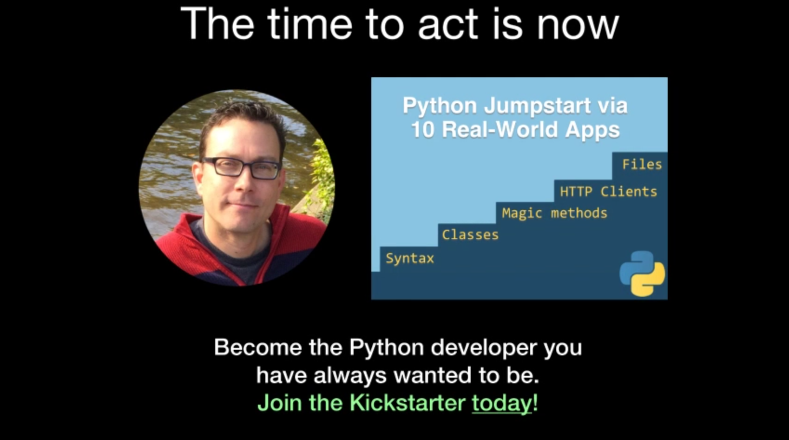

# Python Jumpstart by Building 10 Apps Course Demos

This repository contains all the "handout" materials for my [Python Jumpstart by Building 10 Apps course](https://talkpython.fm). This includes **try it yourself** and **finished** versions of the 10 apps.

Not familiar with my Python jumpstart course? Here's a quick intro video.

The 10 apps
===================

What applications will we build?

We will build the following apps, which among many other things, focus on the language concepts listed under them.

1. [Hello world](https://github.com/mikeckennedy/python-jumpstart-course-demos/tree/master/apps/01_hello_world/you_try)
    * test your environment 
2. [Guess that number](https://github.com/mikeckennedy/python-jumpstart-course-demos/tree/master/apps/02-guess-number-app) 
    * user input
    * conditionals
    * string parsing 
3. [Birthday app](https://github.com/mikeckennedy/python-jumpstart-course-demos/tree/master/apps/03_birthday/you_try)
    * dates and times
4. [Personal journal](https://github.com/mikeckennedy/python-jumpstart-course-demos/tree/master/apps/04_journal/you_try)
    * text-based file i/o 
5. [Weather client](https://github.com/mikeckennedy/python-jumpstart-course-demos/tree/master/apps/05_weather_client/you_try)
    * external packages
    * pip
    * screen scraping
    * HTTP clients 
6. [LOL Cats Factory](https://github.com/mikeckennedy/python-jumpstart-course-demos/tree/master/apps/06_lolcat_factory/you_try)
    * binary files on the internet 
7. Wizard battle
    * classes
    * inheritance
    * magic methods 
8. File searcher
    * navigating the file system
9. Real estate analyzer
    * file formats
    * list comprehensions
    * generators expressions 
10. Movie lookup app
    * error handling
    * exceptions
    * Advanced HTTP clients

Want to enroll in the course?
=============

That'd be wonderful! Currently it's in production. Check out [the Kickstarter page](https://www.kickstarter.com/projects/mikeckennedy/python-jumpstart-by-building-10-apps-video-course) to get a seat for $29 (over half off the final price).

Thanks!

[@mkennedy](https://twitter.com/mkennedy)

 

